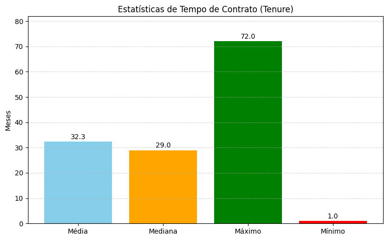

# :floppy_disk: **Telecom X - Análise de Evasão de Clientes**

A Telecom está passando por problemas no grande aumento de evasões de clientes e este projeto teve como objetivo demonstrar maneiras de evitar estas evasões (churn) buscando formas de entender quais foram os motivos que influenciaram esta decisão. Após a análise dos dados de diversas váriaveis, foram identificados fatores predominantes que possivelmente foram a razão destas evasões. 

Neste projeto foi utilizada a linguagem de programação Python e suas bibliotecas para analisar os dados, extrair as informações e aplicá-las nas tomadas de decisões. 

## ✔ Tecnologias utilizadas
- ``Python``
- ``Pandas``
- ``Numpy``
- ``Seaborn``
- ``Matplotlib ``
- ``Jupyter Notebook pelo Google Colab ``
  
# :clipboard: **Extração dos Dados**
Os dados foram extraidos através de uma API em formato JSON

# :round_pushpin: Objetivos do Projeto
* Analisar os dados e entender os motivos das evasões
* Apresentar insights através da análise de dados
* Apresentar conclusões relacionadas a análise
* Apresentar recomendações após a análise e oferecer soluções para a diminuição das evasões

 # **Análise do Dataset e o tratamento das inconsistências**
Após observar os dados do Dataset, foi preciso normalizar as tabelas que estavam aninhadas. Normalizei cada uma das colunas e inseri cada uma delas em dataframes diferentes para facilitar suas leituras. Após normaliza-las, juntei-as a tabela original com o pd.concat. Depois de concatená-las observei cada uma das colunas em busca de inconsistência nos dados;

*   Encontrei na tabela 'Churn' 224 linhas sem valor, alterando-as para "Unknown'
*  Coluna account_Charges.Monthly: Alteração no tipo da coluna para Float64, possibilitando a manipulação dos valores. Alterei também os 11 valores que estavam vazios, tornando-os NaN com a importação da Biblioteca Numpy.

*   Dataframe separado para eliminar os valores abaixo de 0 na tabela customer_tenure, facilitando assim os cálculos posteriormente.

Após o tratamento das inconsistências, criei a coluna account_charges_Daily, que foi utilizada para ter uma visão mais detalhada dos dados. 

# **Padronização e Transformação de Dados**

*   Transformação da coluna Churn em valores binários para facilitar o cálculo de evasões. Resolvi criar uma outra coluna para manter os dados originais.

*  Transformação da coluna customer_gender em valores binários para facilitar o 
cálculo da média de gênero.

*   Transformação dacoluna customer_Partner em valores binários para facilitar o cálculo da média de parceiros.

*   Transformação da coluna customer_Dependents em valores binários para facilitar o cálculo da média de dependentes.

*  Transformação da coluna phone_PhoneService em valores binários para facilitar o cálculo da média da quantidade de clientes com serviço telefônico.

*   Transformação da coluna account_PaperlessBilling em valores binários para facilitar o cálculo da média da quantidade de clientes com Fatura digital

  # **Análise Descritiva**
Após a análise dos dados foi possivel obter alguns insights. Inicialmente o objetivo foi identificar a porcentagem de Evasões.
 
 
Como a taxa indicada era alta, foi preciso buscar em outras variáveis motivos para tamanha alta em evasões, e como evitá-las. O primeiro passo foi calcular a parte financeira, obtendo os seguintes dados:

# **Média de Gastos**

Média diária em R$: 2.16

Média mensal em R$: 64.72

Média total em R$: 2280.63

# **Perfil dos Clientes**
Neste insight também foi possivel ter um aprofudamento maior no perfil do cliente, sendo que;

51% dos clientes são Homens

49% dos clientes são mulheres

Sendo que 16% do clientes são idosos

48% possuem parceiro(a)

30% possuem dependentes

90% Possuem serviço telefônico

59% utilizam fatura digital

# **Tempo de fidelidade do Cliente**
Neste insight foi possivel calcular qual era o tempo médio de contrato dos clientes. Com esse dado foi possivel observar qual o tempo médio em que o cliente era mais propenso a cancelar o serviço. 

# Relação do tempo de contrato e Evasões:

 - Os dados também possibilitaram uma análise aprofudanda em outras variáveis categóricas como o Gênero, Tipo de contrato, Método de pagamento e Serviço de Internet.
 - 
   
   
   
    

   

  # Análise de Dados Financeiros
  Após o cálculo da media dos valores diários, mensais e totais das faturas cobradas, obteve-se um dos possiveis fatores predominantes para a alta taxa de evasões, a cobrança mensal. A cobrança mensal teve destaque negativamente nesta categoria.
  

 # Conclusões e Insights
- Clientes com menos tempo de contrato são mais propensos a cancelar o serviço.
- Clientes com contratos mensais são os que apresentam maior taxa de cancelamentos, sendo o cheque eletrônico o método de pagamento que mais se destaca negativamente.
- Clientes do gênero feminino cancelam mais o serviço
- Clientes que utilizam a Fibra ótica tem um alta taxa de cancelamento, comparado a outros serviços de internet.

# :page_facing_up: Recomendações
- Na comparação entre o tempo de contrato e as evasões nota-se que os clientes que mais cancelaram são os que geralmente tem o menor tempo de contrato, indicando uma necessidade de uma estratégia inicial de retenção para evitar que os novos clientes cancelem o contrato.

- Revisão da cobrança mensal e incentivo a outros métodos de pagamento diferentes do cheque eletrônico como o débito automático, ou Cartão de Crédito. Como já se trata de um método eletrônico, a troca do cheque por umas destas outras duas opções não alteraria drasticamente a forma de pagamento do cliente. Em último caso, e caso o cliente prefira um pagamento físico, é recomendada a opção de envio por correio.

- As mulheres têm uma tendência maior em cancelar o serviço. Neste caso, estratégias de marketing direcionadas às mulheres são recomendadas, para assim evitar mais evasões no futuro.

- O serviço de Fibra ótica é o que mais possui cancelamentos nos serviços de Internet. Neste caso, é necessário uma análise aprofundada no modo com o que o serviço está sendo oferecido, e utilizando-se de feedbacks dos clientes, aplicar melhorias neste serviço.
  
   ##  Acesso ao projeto
Você pode [acessar o código do projeto](https://github.com/GSBorbely/Challenge-TelecomX/tree/main)

